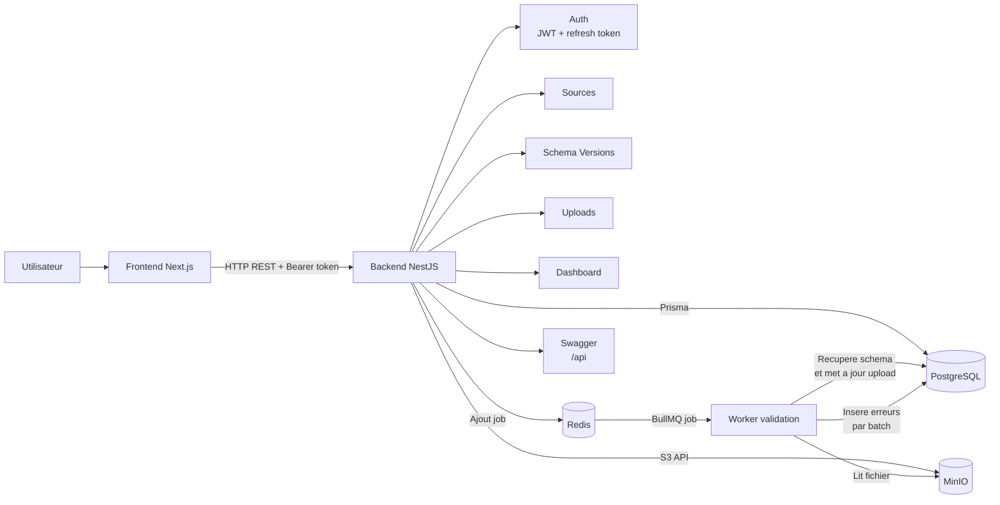
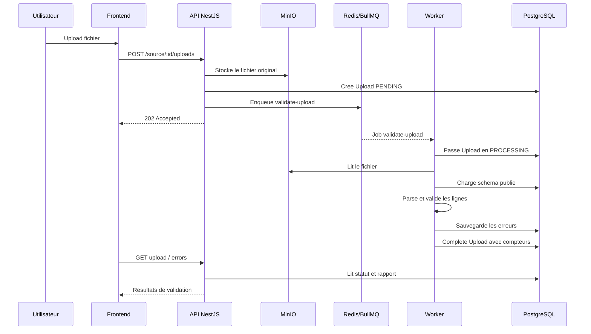

# Design et architecture - DataKontrol

## 1. Comprehension du projet

DataKontrol est une plateforme de controle qualite pour fichiers tabulaires. L'objectif est de permettre a un utilisateur de declarer une source de donnees, de lui associer un schema attendu, puis d'uploader des fichiers CSV ou Excel afin de detecter les erreurs de structure et de typage.

Le besoin principal n'est pas seulement de dire si un fichier est valide ou invalide. Le systeme doit aussi produire un rapport exploitable: nombre de lignes traitees, lignes valides, lignes invalides, colonne concernee, type d'erreur et valeur fautive. Cela permet a l'utilisateur de corriger son fichier sans devoir analyser manuellement toutes les donnees.

Le parcours fonctionnel cible est le suivant:

1. L'utilisateur cree un compte et se connecte.
2. Il cree une source de donnees, par exemple "Ventes Orange CI" ou "Stock Banque Atlantique".
3. Il cree une version de schema pour cette source, ou duplique une version existante pour partir d'une base deja validee.
4. Il publie le schema a utiliser comme reference.
5. Il upload un fichier CSV, XLS ou XLSX.
6. Le backend stocke le fichier, cree un upload en base et lance la validation en asynchrone.
7. L'utilisateur consulte le statut de traitement et les erreurs detectees.

Le dossier `data` sert de base de demonstration avec deux sources, chacune ayant un fichier propre et un fichier volontairement incorrect.

## 2. Architecture generale

Le projet est separe en deux applications:

- `backend`: API NestJS responsable de l'authentification, du domaine, de la validation, de la persistance et du traitement asynchrone.
- `frontend`: application Next.js responsable de l'interface utilisateur.

Les services techniques utilises par le backend sont:

- PostgreSQL pour la persistance relationnelle.
- Prisma pour le mapping base de donnees.
- Redis et BullMQ pour la file de validation asynchrone.
- MinIO pour stocker les fichiers uploades via une API compatible S3.
- Swagger pour documenter et tester l'API.

### 2.1 Schema d'architecture



Le frontend communique uniquement avec l'API REST. Le backend garde la responsabilite de la securite, des regles metier et de l'orchestration. Les fichiers sont stockes dans MinIO, les metadonnees et erreurs dans PostgreSQL, et Redis sert uniquement a decoupler l'upload du traitement de validation.

### 2.2 Flux de validation



### 2.3 Backend

Le backend suit une organisation proche de l'architecture hexagonale:

```text
backend/src
├── domain/          # Entites, ports et contrats metier
├── application/     # Use cases applicatifs
├── infrastructure/  # Prisma, MinIO, BullMQ, parsers, securite
├── presentation/    # Controllers, DTO, guards, filters
└── modules/         # Modules NestJS et injection de dependances
```

Cette separation permet de garder les cas d'utilisation independants autant que possible des details techniques. Par exemple, `ValidateUploadUseCase` depend de ports comme `FileStorage`, `FileParser`, `UploadRepository` ou `ValidationErrorRepository`, puis l'infrastructure fournit les implementations concretes avec MinIO, Prisma, CSV parser ou SheetJS.

Les couches jouent les roles suivants:

- `presentation`: expose les routes HTTP, valide les DTO, applique le guard JWT et transforme les exceptions metier en reponses HTTP.
- `application`: orchestre les regles fonctionnelles: creation de source, publication de schema, sauvegarde d'upload, validation de fichier.
- `domain`: contient les entites, statuts, types de schema et contrats abstraits.
- `infrastructure`: connecte l'application au monde externe: base de donnees, stockage objet, file Redis, hash de mot de passe, JWT, parsing.

### 2.4 Frontend

Le frontend est organise par fonctionnalite:

```text
frontend/src
├── app/       # Routes Next.js
├── features/  # Auth, dashboard, sources, schemas, uploads, reports
├── shared/    # API client, hooks, stores, composants et utilitaires communs
└── styles/    # Styles globaux
```

Les appels API passent par une instance Axios partagee. Elle injecte le bearer token, intercepte les erreurs `401`, tente un refresh token, puis rejoue la requete si possible. L'etat de session est conserve cote client avec Zustand.

## 3. Modelisation du domaine

Le domaine est centre autour de cinq agregats principaux.

### 3.1 User

Un utilisateur possede:

- un email unique;
- un mot de passe hashe;
- un refresh token hashe optionnel;
- des sources;
- des uploads.

Le refresh token n'est pas stocke en clair, ce qui limite l'impact d'une fuite de base de donnees.

### 3.2 Source

Une source represente un flux de donnees controle par un utilisateur. Elle a un nom, une description, un proprietaire et une version de schema courante.

Contraintes importantes:

- le couple `(userId, name)` est unique;
- supprimer un utilisateur supprime ses sources;
- une source peut avoir plusieurs versions de schema et plusieurs uploads.

### 3.3 SchemaVersion

Une version de schema decrit les colonnes attendues pour une source. Elle contient:

- un numero de version;
- une definition JSON;
- un statut actif ou non;
- un createur;
- une date de publication optionnelle.

La definition de schema actuelle supporte des colonnes avec:

```text
id, name, type, required
```

Types supportes:

```text
string, integer, decimal, boolean, date, datetime
```

La publication impose qu'un schema contienne au moins une colonne. Le validateur empeche aussi les colonnes avec identifiants ou noms vides, ainsi que les doublons d'`id` ou de `name`.

Une version peut aussi etre dupliquee. Dans ce cas, le systeme cree une nouvelle version brouillon avec la meme `schemaDefinition`, un nouveau numero de version et aucune date de publication. La duplication ne rend jamais le schema actif automatiquement: l'utilisateur doit modifier si besoin puis publier explicitement.

Cette operation respecte la meme contrainte fonctionnelle que la creation manuelle: une source ne peut avoir qu'un seul brouillon non publie a la fois. Cela evite les conflits de travail et garde le parcours de publication simple.

### 3.4 Upload

Un upload represente un fichier soumis a validation. Il garde:

- la source;
- la version de schema utilisee;
- l'utilisateur;
- le nom, la taille, le type et le chemin de stockage du fichier;
- le statut de traitement;
- les compteurs `totalRows`, `validRows`, `invalidRows`;
- la date de creation et la date de fin.

Les statuts possibles sont:

```text
PENDING, PROCESSING, COMPLETED, FAILED
```

Le choix de figer `schemaVersionId` dans l'upload est important: un upload reste auditable meme si un nouveau schema est publie plus tard.

### 3.5 ValidationError

Une erreur de validation est rattachee a un upload. Elle contient:

- le numero de ligne;
- le nom de colonne;
- le type d'erreur;
- le message;
- la valeur fautive si elle existe.

Les index sur `uploadId` et `(uploadId, rowNumber)` facilitent la pagination du rapport d'erreurs.

## 4. Cycle de validation

Le traitement d'un fichier suit cette sequence:

1. Le controller recoit un fichier via `multipart/form-data`.
2. Le backend verifie l'extension et le type MIME supportes.
3. `SaveFileUseCase` stocke le fichier dans MinIO.
4. Un enregistrement `Upload` est cree en statut `PENDING`.
5. Un job BullMQ `validate-upload` est ajoute dans Redis.
6. Le worker BullMQ recupere le job et appelle `ValidateUploadUseCase`.
7. L'upload passe en `PROCESSING`.
8. Le fichier est relu depuis MinIO.
9. Le parser CSV ou Excel produit les lignes sous forme de records.
10. Le validateur controle les headers, les champs requis et les types.
11. Les erreurs sont inserees en base par batch de 500.
12. L'upload passe en `COMPLETED` avec les compteurs finaux.
13. En cas d'echec definitif du job, l'upload passe en `FAILED`.

Cette approche evite de bloquer la requete HTTP pendant toute la validation et permet de suivre un traitement potentiellement long.

## 5. Choix techniques

### NestJS

NestJS apporte une structure claire pour separer controllers, services, modules, guards et filtres. Il est bien adapte a une API metier avec authentification, injection de dependances et documentation Swagger.

### Prisma et PostgreSQL

PostgreSQL est pertinent pour ce projet car les donnees sont relationnelles: utilisateurs, sources, versions de schema, uploads et erreurs. Prisma facilite les migrations, le typage et la lecture du modele de donnees.

### BullMQ et Redis

La validation de fichiers est asynchrone par nature. BullMQ permet de decoupler l'upload du traitement, de gerer les retries et d'eviter des timeouts HTTP. Le job utilise l'`uploadId` comme identifiant, ce qui rend le traitement plus simple a tracer.

### MinIO / S3

Les fichiers originaux sont stockes hors base de donnees. MinIO permet d'avoir un stockage compatible S3 en local, tout en gardant une architecture proche d'une cible cloud.

### Parsers CSV et Excel

Le CSV est parse en streaming, ce qui est adapte aux fichiers plus volumineux. Excel est lu en buffer, car la librairie SheetJS travaille naturellement sur un workbook complet. Une limite de 10 Mo reduit le risque memoire.

### JWT + refresh token

L'API utilise un access token pour proteger les routes metier et un refresh token pour renouveler la session. Le refresh token est hashe avant stockage.

### Frontend Next.js

Next.js fournit une base solide pour structurer l'interface par pages. TanStack Query gere les donnees serveur, Axios centralise les appels API et Zustand garde la session utilisateur.

## 6. Ce qui a bien fonctionne

- La separation en couches rend le backend lisible et extensible.
- Les use cases sont identifies clairement et correspondent aux actions metier.
- Le traitement asynchrone des uploads evite de bloquer l'API.
- L'association d'un upload a une version precise de schema rend les resultats auditables.
- La duplication de schema evite de repartir de zero quand une source evolue legerement.
- Les erreurs de validation sont stockees ligne par ligne, ce qui permet un rapport exploitable.
- Le stockage objet evite de mettre les fichiers binaires en base.
- Le backend gere les fichiers CSV et Excel.
- Les migrations Prisma et le `compose.yaml` facilitent la reproduction de l'environnement.
- Le front est decoupe par features, ce qui rend les pages plus faciles a maintenir.

## 7. Limites et points qui ont moins bien marche

- Le schema de validation reste volontairement simple: il ne gere pas encore les contraintes avancees comme min/max, regex, enum, unicite, longueur maximale ou formats metier.
- La duplication de schema est volontairement limitee a la meme source; il n'existe pas encore de copie de schema entre sources differentes.
- Le type `date` accepte uniquement le format ISO `YYYY-MM-DD`, alors que certains fichiers de demonstration utilisent des formats comme `DD/MM/YYYY`. Il faudrait rendre le format configurable par colonne ou par source.
- Le CSV parser utilise la configuration par defaut de `csv-parse`. Les delimiters specifiques par source, par exemple `;`, ne sont pas encore modelises dans le schema.
- Les erreurs lancees par les parsers sont des erreurs techniques generiques. Elles pourraient etre transformees en erreurs metier plus lisibles.
- Excel est charge en memoire, ce qui est acceptable avec la limite de 10 Mo mais moins adapte a de tres gros fichiers.
- Le worker BullMQ est embarque dans le meme processus NestJS que l'API. C'est simple en local, mais en production il serait preferable de separer API et worker.
- Le telechargement des lignes valides est disponible, mais il regenere un CSV depuis le fichier original au moment de la demande.
- Le modele ne stocke pas les donnees validees, seulement les erreurs et le fichier original.
- La gestion multi-tenant est basee sur l'utilisateur, mais il n'y a pas encore d'organisation, de role ou de permission fine.
- Les tests automatises peuvent etre renforces, surtout sur la validation, les parsers et les workflows d'upload.

## 8. Ameliorations potentielles

### Validation

- Ajouter des contraintes de colonne: `min`, `max`, `minLength`, `maxLength`, `regex`, `enum`, `unique`, `nullable`.
- Permettre de configurer le format de date par colonne.
- Permettre de configurer le separateur CSV, l'encodage et la presence du header par source.
- Ajouter des regles inter-colonnes, par exemple `date_fin >= date_debut`.
- Ajouter des regles conditionnelles, par exemple "si type = entreprise, alors siret requis".
- Produire un fichier d'erreurs enrichi telechargeable.

### Architecture et exploitation

- Separer le worker BullMQ dans un processus ou conteneur dedie.
- Ajouter une strategie de nettoyage des anciens fichiers et anciens rapports.
- Ajouter des metriques: duree de validation, taux d'erreur, nombre de jobs echoues.
- Ajouter une observation plus complete: logs structures, correlation id, traces.
- Rendre les retries et la concurrence du worker configurables par environnement.
- Ajouter une politique de retention des uploads.

### Domaine

- Introduire des organisations et des roles: admin, data owner, viewer.
- Ajouter un workflow de validation de schema avant publication.
- Ajouter une notion de source active/inactive.
- Gerer des schemas importables/exportables.
- Permettre de dupliquer un schema vers une autre source, avec adaptation des colonnes si necessaire.
- Ajouter un historique des actions utilisateur.

### API et securite

- Ajouter du rate limiting sur l'authentification et l'upload.
- Ajouter une validation plus stricte des types MIME avec inspection du contenu.
- Ajouter une rotation plus complete des refresh tokens.
- Ajouter des tests e2e couvrant auth, source, schema, upload et rapport.
- Ameliorer les messages d'erreur API pour les erreurs de parsing.

### Frontend

- Ajouter un assistant de creation de schema depuis un fichier exemple.
- Ajouter une previsualisation du fichier avant validation.
- Ajouter un suivi temps reel des statuts via WebSocket ou Server-Sent Events.
- Ajouter des filtres avances sur les rapports d'erreurs.
- Ajouter des graphiques par source: taux de validite, evolution des erreurs, top colonnes en erreur.
- Ajouter des etats vides et erreurs plus explicites dans les pages metier.

## 9. Arbitrages

Le projet privilegie une base propre et demonstrable plutot qu'un moteur de validation exhaustif. Les choix structurants ont donc ete:

- garder le modele de schema simple pour livrer rapidement le parcours complet;
- autoriser la duplication de version pour accelerer les evolutions de schema sans ajouter un systeme complexe de templates;
- utiliser une architecture decouplee pour pouvoir enrichir les regles plus tard;
- traiter les uploads en asynchrone des le depart;
- stocker les fichiers dans un objet store plutot qu'en base;
- garder une API REST classique et documentee par Swagger.

Ces arbitrages donnent une application fonctionnelle, extensible et proche d'une architecture production, tout en laissant des axes clairs pour aller vers un produit de controle de donnees plus complet.

## 10. Deploiement

Le projet est deploye en gardant le mono-repo GitHub. Chaque plateforme pointe vers le sous-dossier qui la concerne:

- Frontend: Vercel, avec `frontend` comme root directory.
- Backend: Render, avec `backend` comme root directory et un build Docker base sur `backend/Dockerfile`.
- Base de donnees: PostgreSQL managé sur Render.
- File de jobs: Render Key Value compatible Redis, utilise par BullMQ.
- Stockage fichier: Cloudflare R2 via API compatible S3.

Le frontend de production est disponible a l'adresse:

```text
https://datakontrol.vercel.app
```

Le backend expose l'API NestJS sur Render. La variable `NEXT_PUBLIC_API_URL` du frontend pointe vers l'URL publique Render suffixee par `/api`.

Ce choix permet de garder une separation claire:

- Vercel sert l'interface Next.js.
- Render execute le backend, les migrations Prisma au demarrage et le worker BullMQ embarque.
- PostgreSQL conserve les metadonnees, schemas, uploads et erreurs.
- R2 conserve les fichiers originaux.
- Redis conserve les jobs de validation.

Pour une montee en charge plus serieuse, l'evolution naturelle serait de separer le worker BullMQ dans un service Render dedie, au lieu de le garder dans le meme processus que l'API.
